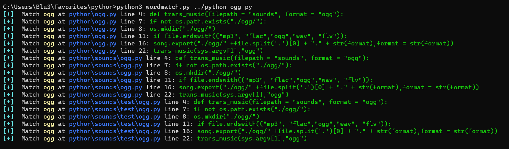
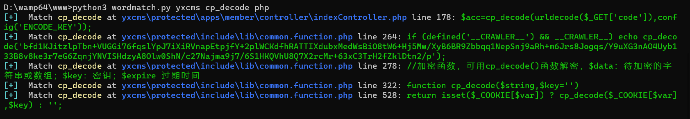

# WordMatch
WordMatch is a simple tool that lets you search for a specific word within files located in a specified directory.

`Usage: python3 wordmatch.py -p [directory_path] -w [word] -e [extension]`

 `example: python3 wordmatch.py -p D:\\books -w alice -e txt`

## new feature
WordMatch now allows you to search files without limiting the search to a specific file extension.

If you don't want to limit your search to a specific file extension, simply omit the -e option.

demo:

 

 

I use WordMatch to quickly search for function usages in tons of code because I'm too lazy to set up a more complex environment. 

I plan to optimize WordMatch in the future.